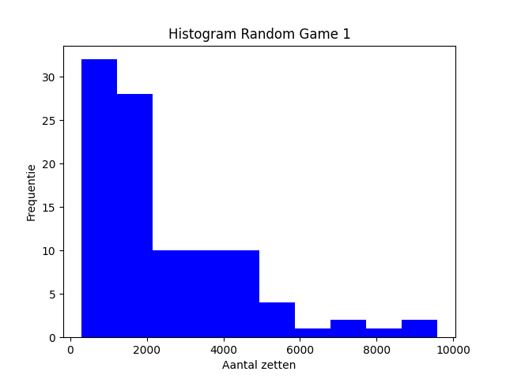

# Baseline 

We hebben momenteel ons random algoritme 100 keer laten draaien op de boarden 6x6 - 1, 6x6-2 en 6x6-3. De uitkomst van de drie grids is te zien in onderstaande histogrammen:

Doormiddel van deze baseline willen we alle mogelijke oplossingen met elkaar vergelijken nadat we een willekeurige steekproef hebben gedaan. 

In de 6x6-1 grid is de verdeling van de oplossingen redelijk gelijk verdeeld al zijn er wel een aantal outliers. Zo is te zien dat een oplossing bijvoorbeeld 15000 zetten heeft gezet, maar er is ook een oplossing met maar 323 zetten. De meeste oplossingen zitten rond de 5000 tot 7500 zetten. 

In de 6x6-2 grid zijn de uitkomsten van de grid ook gelijkwaardig verdeeld er zijn zoals te zien minder uitschieters dan bij de 6x6-1 grid. Overigens wat wel opvalt is dat de aantal sets gemiddeld veel lager liggen dan bij de 6x6-1 grid. Bij de 6x6-1 grid liggen de meeste uitkomsten tussen de 2500 en 3000 sets. Terwijl dit gemiddelde eerder 2 keer zo hoog was. Overigens liggen de uitschieters tussen een range van 200 tot en met 7000 uitkomsten liggen. 

In de 6x6-3 grid zijn de uitkomsten van de grid minder gelijkwaardig verdeeld. Er zijn veel meer uitshieters dan bij de andere 2 grids. De grootste outlier die te zien is in de 6x6-3 grid ligt maar liefst boven een aantal zetten van 50000. Het gemiddelde ligt rond de 25000, dit gemiddelde ligt veel hoger dan bij de andere grids. De laagste outlier ligt bij rond 2500.
De zetten die worden gemaakt in ons algoritme zijn gekozen uit een lijst van alle mogelijke zetten per auto. 

Ons algoritme genereert inprincipe willekeurige oplossingen, maar tijdens het coderen en het debuggen hebben we een aantal keuzes gemaakt waardoor onze code mogelijk biased is. De keuzes die wij hebben gemaakt zijn onder andere: 
- Als een auto een bepaalde richting op gaat, hebben we ervoor gekozen om de eerst volgende zet dezelfde auto niet de mogelijkheid te geven om terug te kunnen verplaatsen. Hierdoor zijn er minder sets nodig voor de oplossing. Hiermee hebben we ons algoritme dus eigenlijk al verbeterd.
- De tweede consessie die wij hebben gemaakt is dat onze auto's maar een stap per keer kunnen zetten. Hierdoor zullen de zetten wellicht hoger uitvallen per oplossing. 

